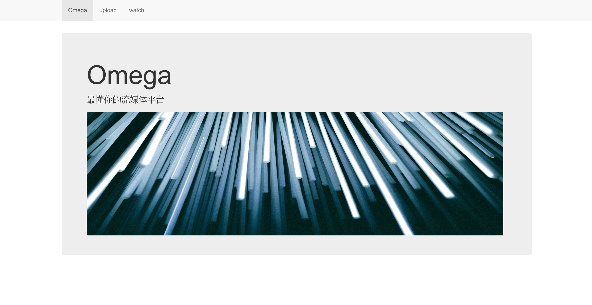
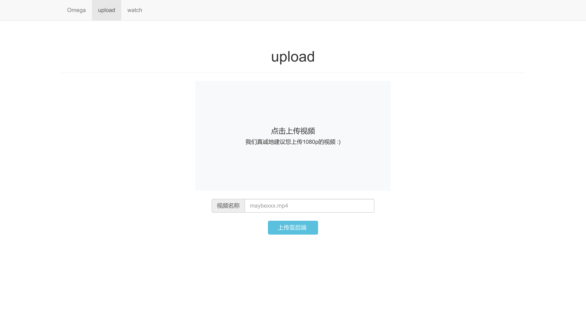

# Omega-video

# 软件体系结构-最后的大作业

## 1.视频demo

https://www.bilibili.com/video/BV1XU4y157PV

## 2.页面展示

操作系统： Arch Linux 

视频上传和播放页面： html+javascript+bootstrap3 实现

使用了node.js 与消息队列以及文件系统交互。

### 主页面

### 上传页面

### 视频播放页面

## 3.后端部分

### 视频转码

使用spring-boot框架， 定时从消息队列中提取消息，然后将1080p视频转化为720p和360p, 转码使用JAVE2库。 

### 文件存储

轻量级的文件服务——minio。

前端页面实现了上传和读取视频文件的功能，

参考了官方样例的实现 https://github.com/minio/minio-js-store-app 。

spring-boot与minio交互实现了读取视频和将重新编码的视频上传的功能，

参考了官方文档的实现：https://github.com/minio/minio-java/tree/master/examples 。

### 消息队列

使用了RabbitMQ。

node.js 调用rabbitMQ用于上传具体的视频信息，

参考了官方样例中的实现：https://github.com/rabbitmq/rabbitmq-tutorials/tree/master/javascript-nodejs 。

spring-boot 调用rabbitMQ读取视频信息，

参考了官方文档中的实现：https://github.com/rabbitmq/rabbitmq-java-client 。

## 4. 操作流程

1.使用docker打开文件存储服务和rabbitMQ消息队列服务，具体的运行脚本可以参考 scripts 文件夹中的内容。

2.运行spring-boot程序，实现将传来的视频进行编码的过程，程序参考encode文件夹中的内容。

3.打开font文件夹，运行node app.js ，用于为前端页面提供消息队列和文件系统的接口调用服务, 使用chrome浏览器打开index.html页面，就可以进行一系列的操作了。

## 5.压力测试

利用docker打开多个文件系统实例，利用haproxy文件夹中的程序执行 haproxy -g haproxy.cfg 进行负载均衡。

之后编写gatling脚本（见gatlingtest文件夹）就可以进行压力测试，模拟了200个用户对接口进行了访问。

一共进行了两次对比实验，压力测试的结果放在了report中。

first对应的是单个minio文件系统实例，平均响应时间为638ms;

second 对应的是4个minio文件系统实例，平均响应时间为1026ms。

之所以提高了文件系统的实例反而不降反升，我分析认为是多个文件系统的调度开销大于了访问文件的开销，而且系统整体的性能瓶颈在于视频的转码，所以仅仅提高文件系统的实例无法有效缓解这个瓶颈问题。

对于多个视频转码实例水平扩展的压力测试，有待进一步的探讨。

## 6. 参考链接

https://github.com/njuics/sa-2021/wiki

https://github.com/minio/minio-js-store-app

https://github.com/rabbitmq/rabbitmq-java-client

https://github.com/fromddy/Planet-Algorand-with-NFT
